# Priced out of the formal market: A housing affordability index for Greater Kampala, Uganda, from online listings and spatial machine learning

[TO COMPLETE: Author names]¹ 
¹ [TO COMPLETE: Department], University of Johannesburg, Johannesburg, South Africa; corresponding author: [TO COMPLETE: e-mail]

**Abstract:** Housing policy in Uganda rests on national aggregates that cannot show how affordable the housing on offer is to the households who would need it, or where. We construct a transparent, reproducible Housing Affordability Index for the Greater Kampala Metropolitan Area (GKMA) from 10,643 deduplicated online listings, Census 2024 small-area indicators, household survey incomes and Bank of Uganda lending rates. The index combines rental and ownership indices, adapted to Ugandan mortgage terms, with a gap index giving the share of households priced out, and is reported for the GKMA, its districts and sub-counties. Prices are modelled with hedonic and multiscale geographically weighted regression and spatially validated machine learning. The median household earns 18% of the income needed to rent the median listed one- to two-bedroom home at 30% of income, and 4% of that needed to buy the median listed house with a mortgage. The result holds for any burden threshold from 10% to 80% of income, and a residual-income test shows that the typical listed rent would push three in five households below the poverty line. Listings capture an almost entirely titled, formal market; location and neighbourhood status drive prices, and land accounts for about half of house prices.

**Keywords:** housing affordability index; mortgage affordability; hedonic pricing; geographically weighted regression; spatial machine learning; SHAP; online property listings; land tenure; small-area estimation; Kampala; Uganda

---

## 1. Introduction

Urban Africa is growing faster than its formal housing supply, and Kampala is a prominent case. The Greater Kampala Metropolitan Area (GKMA)—Kampala Capital City and the surrounding districts of Wakiso and Mukono, with fringes in Mpigi, Buikwe and Luwero—concentrates a large share of Uganda's urban population, formal employment and economic output [@unhabitat2011; @lall2017]. National policy recognises a large and persistent housing deficit and has made "affordable housing" a stated priority [@molhud2016]. Yet the evidence that underpins these debates is almost entirely aggregate: national estimates of the housing deficit, mortgage penetration and average rents. Such figures cannot show *where* within the metropolitan area housing is priced beyond what local households earn, how large that gap is, or what drives the price differences that produce it.

Household surveys provide rich information on how Ugandans live, but not on the market for housing. The Uganda National Household Survey (UNHS) 2019/20 shows that three quarters of Kampala households rent, and that four in five renting households in Kampala occupy a single room [@ubos2021unhs]. Surveys, however, are not designed to observe asking prices across neighbourhoods, and their sample sizes do not support estimates below the sub-region. The Uganda Bureau of Statistics' Residential Property Price Index tracks price movements for four broad areas of Kampala and Wakiso [@ubos2026rppi], but not price levels or their spatial variation.

Online property listings are now the largest open record of housing supply in Kampala. Internationally, scraped listings have been used to study rental markets at scale, with the caveat that online platforms represent some segments and neighbourhoods better than others [@boeing2017; @boeing2020]. In Uganda, listings have barely been used in research. The closest studies estimate tenure effects on the values of new houses from transaction records [@irumba2015], compare machine-learning and hedonic predictions of rents reported in household surveys [@embaye2021], survey affordability among Kampala residents [@mirembe2016], and model how land tenure shapes land use in the city [@birdvenables2020]. None maps prices and affordability across the metropolitan area at a fine spatial scale.

This paper builds that evidence base and, from it, a housing affordability index for the metropolitan area. We assemble 10,643 deduplicated listings from three portals, locate them to neighbourhoods and the official parishes and sub-counties that contain them, and link them to Census 2024 small-area indicators, household survey incomes, Bank of Uganda lending rates, OpenStreetMap accessibility measures, night-time lights and construction-cost benchmarks. We address four research questions:

- **RQ1.** How are asking prices and rents (per bedroom and per decimal of land) distributed across the GKMA, and where do they cluster?
- **RQ2.** Which property, location, neighbourhood and tenure attributes drive prices, and how does their influence vary across space?
- **RQ3.** Do machine-learning models predict prices better than conventional hedonic models under spatially honest validation, and what do they reveal about price drivers?
- **RQ4.** How affordable is the housing on offer in the GKMA—for renting and for mortgage-financed ownership—and how does affordability vary between districts and sub-counties? We answer this by constructing a GKMA Housing Affordability Index.

A fifth, linked objective decomposes house prices into land and structure to show how much of the affordability problem is a land problem.

The paper makes four contributions. First, it constructs the first housing affordability index for the GKMA, and to our knowledge for Uganda: a rental index, an ownership index adapted to Ugandan mortgage conditions, and a distributional gap index, each built from open data and reproducible quarterly. Second, it provides a metropolitan-wide spatial evidence base on housing prices at district and sub-county scale, built from online listings. Third, it documents a reproducible pipeline for turning messy Ugandan listings into analysable data—handling mixed currencies, per-plot pricing, Luganda spelling variants, unreliable portal location labels, reconstructed posting dates and cross-portal duplication—and a method for estimating small-area incomes from published statistics alone. Fourth, it combines spatial econometrics and spatially validated machine learning, showing how price drivers vary across the city and how much random cross-validation overstates predictive accuracy. A substantive finding runs through the results: the online market is almost entirely a titled, formal market, so the index measures the gap between the formal housing on offer and the incomes of the households who would need it.

The remainder of the paper is organised as follows. Section 2 reviews the literature and sets out the theoretical framework. Section 3 presents the conceptual framework and hypotheses. Section 4 describes the study area, data and methods. Sections 5 and 6 present and discuss the results, and Section 7 concludes.

## 2. Literature Review and Theoretical Framework

The study draws on five bodies of theory, labelled T1–T5 in the conceptual framework (Figure 1).

### 2.1. Hedonic price theory (T1)

Hedonic price theory treats a dwelling as a bundle of characteristics whose implicit prices are revealed by market prices [@rosen1974]. Regressing price on structural, locational and neighbourhood attributes recovers these implicit prices, a method that has become the standard tool for housing valuation and index construction [@sirmans2005]. Neighbourhood attributes—the socio-economic status of the area, local amenities and environmental quality—enter alongside structural ones, and their omission biases estimates of both [@can1992]. Two features of the Kampala context shape the application. First, floor area is rarely reported in listings, so prices are normalised per bedroom for dwellings and per decimal (1/100 acre) for land. Second, hedonic estimates from asking prices describe the price expectations of sellers and agents rather than transaction outcomes; they are informative about the supply on offer and the prices households face when searching.

### 2.2. Bid-rent theory and urban land economics (T2)

In the monocentric model of Alonso, Muth and Mills, households trade off accessibility to the centre against space, producing land and housing prices that decline with distance from the central business district [@alonso1964; @muth1969; @mills1967]. Extensions to polycentric cities allow for secondary centres and transport corridors [@anas1998]. For Kampala, the model predicts a price gradient from the core, modified by corridors such as the Kampala–Entebbe Expressway and the Northern Bypass, and by the concentration of high-income neighbourhoods on the city's hills. Urban land economics also motivates the decomposition of property prices into land and structure: where land is scarce relative to demand, land accounts for a rising share of house prices, and construction costs alone cannot explain high prices [@davis2007; @glaeser2005].

### 2.3. Property rights and tenure security (T3)

Secure, registered property rights are argued to raise asset values, enable collateralised lending and encourage investment [@desoto2000; @besley1995]. Critics caution that titling does not automatically deliver these benefits and may displace poorer occupants [@payne2009]. Uganda's tenure system gives these debates particular force. Four tenure systems—customary, freehold, mailo and leasehold—coexist under the 1995 Constitution and the Land Act [@landact1998]. On mailo land, a registered owner's title overlaps with the occupancy rights of *bibanja* holders, and overlapping rights have been linked to lower investment [@deininger2008]. In Kampala, mailo tenure skews land use towards informal housing [@birdvenables2020], and the one hedonic study of tenure finds price differences between leasehold, mailo and freehold houses [@irumba2015]. Tenure therefore enters the framework twice: as a price determinant, and as a filter on which properties reach the formal, online market at all.

### 2.4. Housing affordability (T4)

Affordability is most often measured as a ratio of housing costs to income, with 30% the conventional threshold, although the ratio approach has been criticised for conflating affordability with consumption choices [@hulchanski1995]. The residual-income approach asks instead whether households retain enough income for non-housing needs after paying for housing [@stone2006]. For ownership, affordability indices compare the income of a typical household with the income needed to service a mortgage on a typical home: the US National Association of Realtors' Housing Affordability Index sets this at 100 when the median-income family can just qualify for a mortgage on the median-priced home, given a deposit and a repayment-to-income cap [@nar]. Such indices are transparent and easy to update, but they describe a typical household rather than the distribution of households. This study combines both perspectives: ratio-based rental and ownership indices for the typical household, and a distributional gap index giving the share of households whose income falls below the qualifying income. Ratio measures are used because they can be computed consistently from published data at sub-county scale; their limitations relative to the residual-income approach are acknowledged.

The 30% threshold itself is a convention rather than a theoretical result. It entered policy through US public-housing rent rules (25% of income from 1969, raised to 30% in 1981) and mortgage underwriting ratios, and it is now used to classify households as cost-burdened (above 30%) or severely cost-burdened (above 50%) [@hulchanski1995; @hud2014]. Two theoretical arguments question a single fixed threshold. First, the residual-income approach holds that what matters is the income left for non-housing needs after paying for housing [@stone2006]; because those needs are roughly fixed in absolute terms, a low-income household can tolerate a much smaller housing share than a high-income one, so any fixed ratio is too lenient at the bottom of the distribution and too strict at the top. Housing costs that push a household's remaining income below the poverty line constitute housing-induced poverty [@kutty2005]. Second, the share of income spent on housing falls as income rises (Schwabe's law), and in low-income cities many households already spend far more than 30% of income on housing, so the norm that suits a mature mortgage market may not describe a Global South city [@haffner2021]. We therefore treat the threshold as a normative parameter rather than a fixed fact, and report affordability across a gradient of tolerable burdens from 10% to 80% of income. The gradient reveals how conclusions depend on the choice of norm and lets readers apply their own threshold. The fixed 30% ratio is retained as the headline reference point for comparability with international indices.

### 2.5. Spatial heterogeneity and dependence (T5)

Housing markets exhibit spatial dependence—nearby prices are more alike than distant ones [@tobler1970]—and spatial heterogeneity, in that the relationship between price and its determinants varies across space. Global and local indicators of spatial association detect clustering and its location [@moran1950; @anselin1995; @getis1992]. Geographically weighted regression (GWR) estimates local coefficients [@fotheringham2002], and multiscale GWR allows each relationship to operate at its own spatial scale [@fotheringham2017; @oshan2019].

Machine-learning models such as random forests and gradient boosting capture non-linearities and interactions that hedonic models impose away [@breiman2001; @chen2016; @ke2017], and often predict better [@mullainathan2017; @embaye2021]. Two cautions apply to spatial data. First, random cross-validation leaks information between nearby observations and overstates accuracy; spatially blocked validation gives a more honest assessment [@roberts2017; @ploton2020]. Second, predictive models must be interpreted: SHAP values attribute each prediction to its features [@lundberg2017] and, mapped across space, show where each driver matters most [@li2022].

### 2.6. Online listings as evidence

Listings offer scale, timeliness and attribute detail that surveys cannot [@boeing2017], but they are not a random sample of the housing stock. Online platforms over-represent formal, higher-priced and better-connected segments, and under-represent neighbourhoods and tenures that trade informally [@boeing2020]. In Kampala, this selection is likely to be strong: informal rental rooms (*muzigo*) and untitled plots are traded largely through personal networks. We treat this selection as part of the object of study rather than only as a limitation.

## 3. Conceptual Framework and Hypotheses

Figure 1 integrates the five lenses. Asking prices and rents are formed by five groups of determinants: structural attributes (T1), location and accessibility (T2), neighbourhood socio-economic status (T2), tenure and title (T3), and environmental risk (T2). Their implicit prices may be non-linear and interacting, and they may vary across the metropolitan area (T1, T5). What is observed, however, is conditioned by a market visibility filter: online listings capture the formal, titled, upper segment of the market (T3). From observed prices, two outputs follow. Subtracting the depreciated replacement cost of the structure yields an implied land value, which measures the land component of house prices (T2). Comparing the typical listed rent and the mortgage repayment on the typical listed house with the incomes of the households living in the same area yields the affordability index: a rental index, an ownership index, and a gap index giving the share of households priced out (T4). Mortgage terms—the prevailing lending rate, deposit and term—enter the ownership index directly. Together, these outputs form the evidence base for policy.

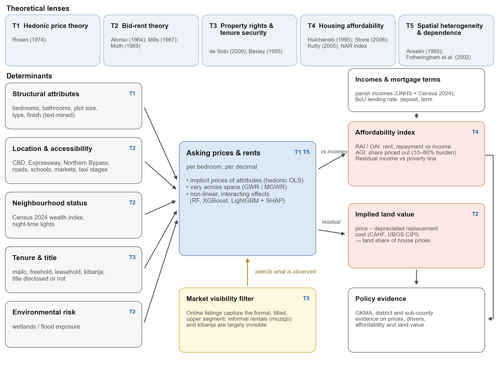

The framework yields five hypotheses:

- **H1** (T2, T5). Asking prices and rents are spatially clustered, with high-value clusters in the central hills and along the Entebbe corridor and low-value clusters on the peri-urban fringe.
- **H2** (T1, T2). Location and neighbourhood socio-economic status account for a large share of price variation, beyond structural attributes, and their effects vary across space.
- **H3** (T3). Listings that disclose a registered title command a price premium; untitled tenures are under-represented among listings.
- **H4** (T5). Machine-learning models outperform hedonic models out of sample, but random cross-validation overstates the performance of all models relative to spatially blocked validation.
- **H5** (T4). The typical listed home is unaffordable to the median household in every district (index below 100), and mortgage-financed ownership is far less affordable than renting under prevailing Ugandan lending terms.

## 4. Materials and Methods

### 4.1. Study area

The study area is the GKMA: Kampala Capital City (five divisions), Wakiso and Mukono districts, and the fringes of Mpigi, Buikwe and Luwero (Figure 2). The analysis uses the Uganda Bureau of Statistics (UBOS) administrative boundaries of 2016–2017, comprising 553 parishes and 79 sub-counties in these six districts; Koome, an island sub-county of Mukono whose parishes consist largely of open lake, is excluded. Kampala's five divisions contain 96 parishes. Census 2024 counts 2.11 million households in the six districts [@ubos2024census]. The metropolitan area spans the Lake Victoria shoreline to the south, the wetland valleys that drain it (Lubigi, Nakivubo, Kinawataka), and the two major road investments of the past decade—the Kampala–Entebbe Expressway and the Northern Bypass.

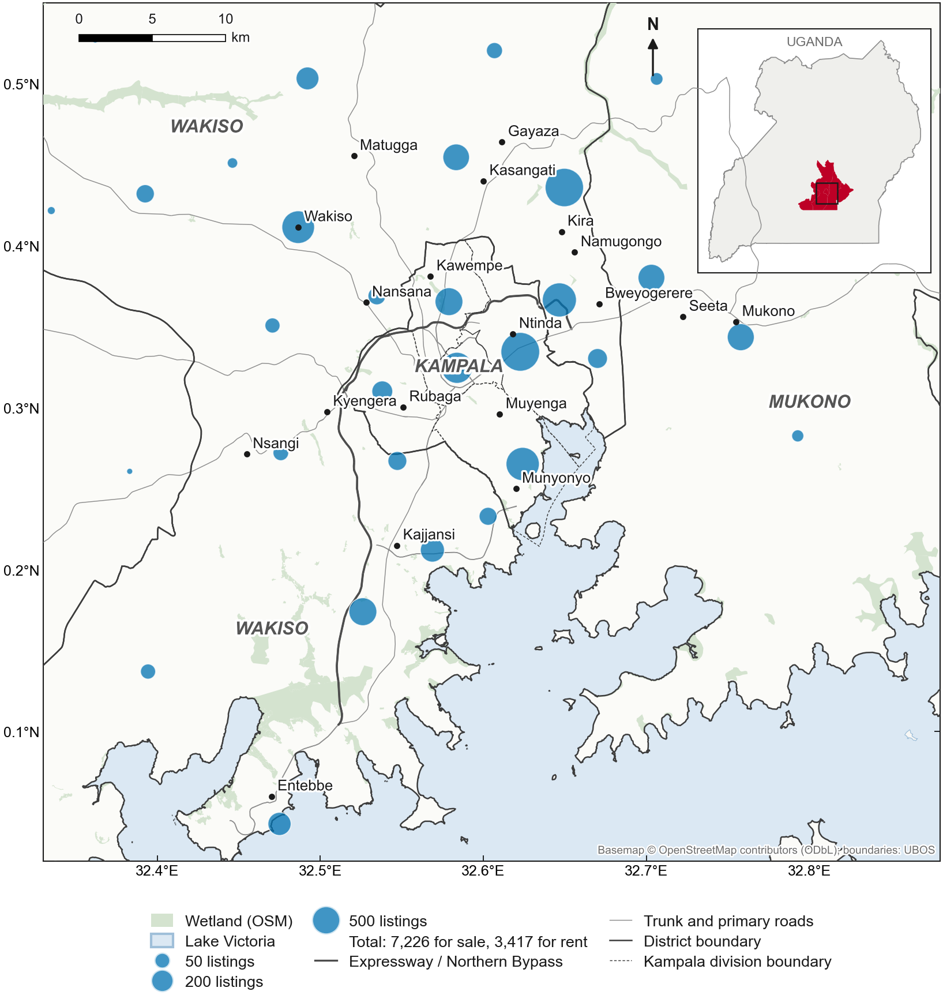

### 4.2. Data

**Table 1. Data sources.**

| Data | Source | Period | Use |
|---|---|---|---|
| Property listings (sale, rent, land) | Three Ugandan portals: RED (also serving Lamudi Uganda), Jiji, Uganda Property Centre | Sep 2025 – Sep 2026 | Prices, rents, attributes, tenure |
| Administrative boundaries | UBOS (parishes 2016, sub-counties 2017) | — | Units of analysis |
| Census 2024 parish profiles | UBOS NPHC 2024 [@ubos2024census] | 2024 | Households, wealth index |
| Household income | UBOS UNHS 2019/20, Table 5.21; Gini, Table 6.10 [@ubos2021unhs]; district Gini [@ubos2019poverty] | 2019/20 | Affordability |
| Consumer prices, exchange rates, lending rates | Bank of Uganda via the MoFPED Macro Data Portal [@bou] | 1981–2026 | Uprating, USD conversion, mortgage repayments |
| Construction cost | CAHF housing cost benchmarking [@cahf2020]; UBOS Construction Input Price Index | 2019–2026 | Land residual |
| Residential Property Price Index | UBOS [@ubos2026rppi] | 2015/16–2025/26 | Validation |
| Roads, amenities, wetlands | OpenStreetMap [@osm] | 2026 | Accessibility, flood proxy |
| Night-time lights | NASA Black Marble VNP46A4 [@roman2018] | 2024 | Economic activity |

**Listings.** Listings were collected from three portals in September 2026; they were posted mainly between August 2025 and September 2026, with a small number of older listings still live. Jiji was collected through its public listing interface; RED and Uganda Property Centre through their public listing pages, at a low request rate that respects each site's robots.txt, with written consent being sought from both operators (Section 4.4). A fourth portal, Lamudi Uganda, serves the same database as RED and was not collected separately. Each record captures price and currency, the price period (monthly rent, outright price, price per plot), location as stated, district, property type, bedrooms, bathrooms, plot size, tenure (on RED), and the free-text description. RED does not display posting dates; because listing codes are issued sequentially, posting dates were estimated from codes calibrated against the first capture of each listing page by the Internet Archive (about 12,000 anchors), with an accuracy of roughly one month.

**Cleaning and text extraction.** Ugandan listings present several problems that the pipeline addresses explicitly and that we document as a methodological contribution:

- *Prices and currencies.* Prices appear in Ugandan shillings or US dollars and in formats such as "Ugx 160,000,000/=", "UGX160M" or "$1,200 per month". USD prices are converted at the Bank of Uganda monthly rate; rents quoted per year, quarter or week are converted to monthly values; nightly (short-stay) listings are excluded.
- *Plot sizes and per-unit pricing.* Plot sizes appear as decimals, acres, "50×100 ft" or "50 by 100" and are converted to decimals. About one land listing in five is priced per plot rather than for the whole parcel; the priced area is then set to one plot.
- *Text features.* Rule-based extraction recovers bedrooms and bathrooms where not given as fields, tenure (mailo, freehold, leasehold, kibanja, customary), whether a title is stated, and features such as self-contained units, boys' quarters, gated compounds, furnishing and shell (incomplete) construction.
- *Implausible values.* Records outside plausibility bounds, and room counts above 15, are flagged and excluded or set to missing.
- *Duplicates.* Agents re-post listings and cross-post them across portals. Candidate duplicates are blocked on listing type, property type, bedrooms and location, and linked when prices agree within 0.5% and descriptions are similar (token-sort similarity ≥ 88), or when the same agent lists an identical price; linked records are clustered and one representative retained. Descriptions rather than titles are compared because one portal generates titles from a template (e.g. "2 bedroom Apartment for rent in Namugongo"), so identical titles do not imply the same unit. On a synthetic benchmark the procedure recovered all re-posts with 0.1% false merges. In the collected data, 10.3% of Jiji, 12.6% of RED and 2.5% of Uganda Property Centre records were duplicates (10.4% overall), and the number of postings per unit is retained as a variable.

**Location.** Portal location labels proved unreliable—for example, neighbourhoods in Nakawa Division were labelled "Central Division". Locations were therefore resolved from the listing's place name through a gazetteer of GKMA neighbourhoods, in order of precedence: exact and alias matches; place names contained in the text; fuzzy matches; names of official UBOS parishes and sub-counties, using a Luganda-aware spelling key that treats *l* and *r* as one phoneme and ignores doubled letters; and, for remaining village names, OpenStreetMap geocoding within the listing's district. Gazetteer points were placed on the representative point of their UBOS parish where the neighbourhood is an official parish, or on an OpenStreetMap-confirmed point otherwise. Of the listings retained, 88.1% were located to a named neighbourhood (exact or contained name matches), 1.9% by fuzzy matching, 3.5% by OpenStreetMap geocoding or an official parish name, and 6.3% only to a sub-county or district; a robustness check restricts the sample to neighbourhood-level matches. Listings naming places outside the six districts were excluded. After cleaning and deduplication, the analysis sample contains 10,643 listings (3,417 for rent and 7,226 for sale, of which 3,320 are land) (Table 2).

**Table 2. Construction of the analysis sample.**

| Step | Listings |
|---|---|
| Raw records, three portals | 13,424 |
| With a parseable price and listing type | 13,418 |
| Location resolved within the study area | 12,311 |
| After deduplication | 10,823 |
| After removing implausible prices | 10,749 |
| Excluding commercial property (analysis sample) | 10,643 |
| of which: rent / sale (dwellings) / sale (land) | 3,417 / 3,906 / 3,320 |
| by portal: Jiji / RED / Uganda Property Centre | 3,736 / 6,029 / 878 |

**Covariates.** Accessibility is measured as distances to the central business district, major roads, the Northern Bypass, the Kampala–Entebbe Expressway, schools, health facilities, markets and taxi stages, and counts of facilities within 1 km, from OpenStreetMap. Flood exposure is proxied by distance to, and location within 200 m of, OpenStreetMap wetlands, since Kampala's floods are predominantly pluvial flash floods in the wetland valleys rather than riverine floods. Economic activity is measured by 2024 annual night-time radiance within 500 m [@roman2018]. Neighbourhood socio-economic status is measured by a parish wealth index: the first principal component of Census 2024 household shares with a television, a computer, grid electricity, improved water and improved sanitation, and not in the subsistence economy [@filmer2001]. The first component explains 72% of the variance across GKMA parishes (61% nationally). Census 2024 parish records were matched by name, within sub-county, to the 2016 parish polygons; 93% of GKMA households fall in matched parishes, the remainder in parishes created or renamed after 2016.

**Parish incomes.** UNHS estimates are not published below the sub-region, and UBOS small-area poverty maps report poverty rates rather than incomes [@ubos2019poverty]. We therefore model parish median household incomes from published statistics alone, following the logic of small-area estimation [@elbers2003]. The wealth index is computed for all 10,598 parishes in Uganda. Across the 15 UNHS sub-regions, the logarithm of median monthly household income in 2019/20 (UNHS Table 5.21) is regressed on the sub-region's household-weighted mean wealth index:

ln(Y_s) = α + β·W̄_s,  estimated as ln(Y_s) = 11.92 + 0.359·W̄_s  (R² = 0.65, n = 15; Figure 4).

Each parish median is then its sub-region's published median scaled by the parish's wealth relative to the sub-region mean, m_p = Y_s · exp(β·(W_p − W̄_s)). Because W̄_s is the household-weighted mean of W_p, each sub-region's household-weighted geometric mean of parish medians reproduces its published UNHS median exactly. Incomes are uprated from 2019/20 to the listing period with the headline consumer price index (×1.297; mean of the UNHS fieldwork months, September 2019–November 2020, to August 2026). Figure 3 maps the resulting parish medians; Table 3 summarises the inputs.

Within each area, household income is assumed to be lognormally distributed. For a lognormal distribution the Gini coefficient G and the standard deviation of log income σ are related by G = 2Φ(σ/√2) − 1, so σ = √2·Φ⁻¹((G + 1)/2), where Φ is the standard normal distribution function. We use district Gini coefficients where UBOS publishes them—Wakiso 0.45 and Mukono 0.44 [@ubos2019poverty]—and sub-region values otherwise (Kampala 0.342, Buganda North 0.343, Buganda South 0.428; UNHS 2019/20 Table 6.10 [@ubos2021unhs]). The Gini coefficient therefore governs the spread of incomes around each parish median—in particular the size of the upper tail of households who could afford higher rents—but not the median itself.

**Table 3. Income inputs to the affordability analysis.** Parish medians are in 2026 prices; the 10th, 50th and 90th percentiles are across parishes within each district.

| District | UNHS sub-region | Sub-region median, 2019/20 (UGX/month) | Gini | σ | Parish median, 2026: P10 / P50 / P90 (UGX/month) |
|---|---|---|---|---|---|
| Kampala | Kampala | 667,000 | 0.342 | 0.626 | 617,000 / 860,000 / 1,407,000 |
| Wakiso | Buganda South | 302,000 | 0.450 | 0.845 | 212,000 / 462,000 / 686,000 |
| Mukono | Buganda North | 208,000 | 0.440 | 0.824 | 188,000 / 253,000 / 557,000 |
| Mpigi | Buganda South | 302,000 | 0.428 | 0.799 | 183,000 / 261,000 / 383,000 |
| Buikwe | Buganda North | 208,000 | 0.343 | 0.628 | 191,000 / 245,000 / 464,000 |
| Luwero | Buganda North | 208,000 | 0.343 | 0.628 | 180,000 / 257,000 / 438,000 |

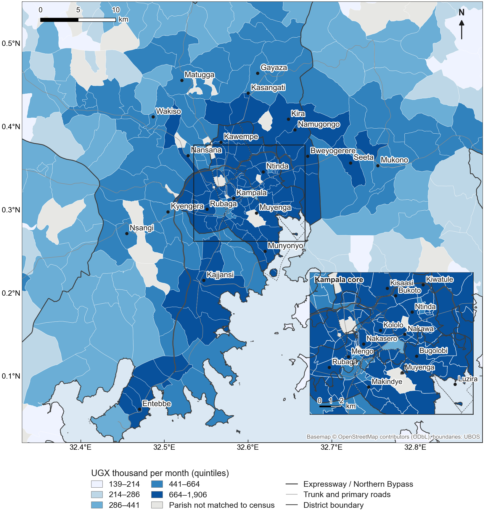

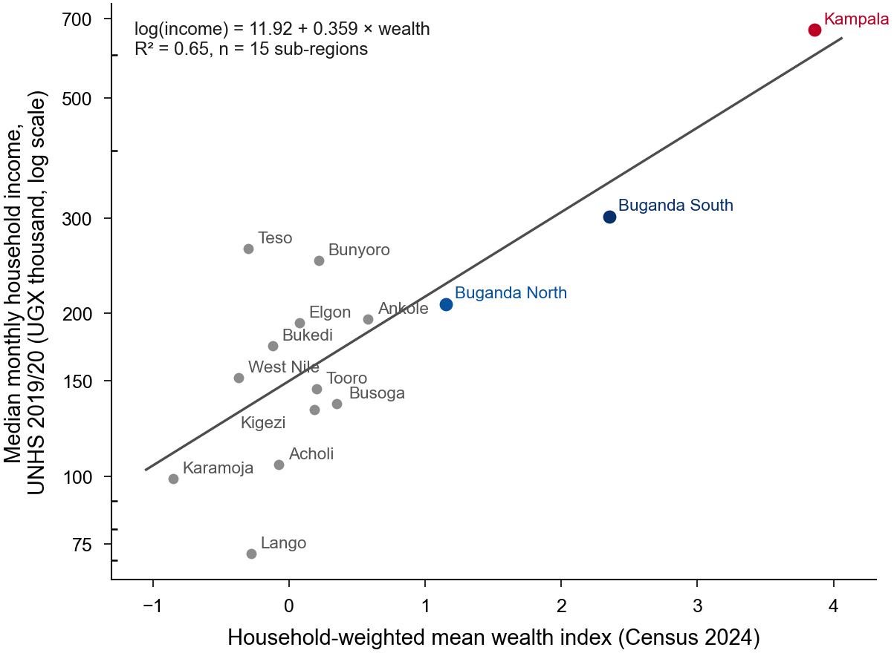

**Construction costs.** Replacement costs per square metre are taken from the bill-of-quantities benchmarks of the Centre for Affordable Housing Finance in Africa for Kampala house types at 2019 prices [@cahf2020], using construction costs (labour, materials and contractor costs) and indexed to 2026 with the UBOS Construction Input Price Index (×1.219). The resulting rates are UGX 1.95 million per m² for a standard house and 3.11 million for an apartment; shell (unfinished) houses are costed at 60% of a finished house, reflecting the 40% share of finishes in the CAHF bill of quantities. The headline index is used because the buildings sub-index is published for too few months to support indexing. Two classes lack a direct CAHF analogue and rest on stated assumptions: storeyed houses are costed at the mean of the bungalow and walk-up apartment rates, and high-specification houses at 1.3 times the standard rate. A sensitivity scenario uses the full non-land development cost (adding professional fees, finance, developer margin and VAT), which roughly doubles the rates.

### 4.3. Analytical methods

**Spatial units and precision.** Because listings identify neighbourhoods rather than addresses, most are located to a neighbourhood point; results are therefore neighbourhood-based and are reported for official units that can be estimated with adequate precision. Headline results are reported for the GKMA and its districts; maps use sub-counties and Kampala's divisions (79 units). An area is reported only if it has at least 20 qualifying listings, a threshold chosen from the precision curve in Supplementary Figure S4: the 95% bootstrap interval of an area's median rent is about ±68% of the median with 5 listings, ±30% with 20 and ±19% with 50 (sale prices: ±106%, ±42% and ±28%). Twenty is the smallest size at which rent intervals reach about ±30%; beyond about 50 listings the gains flatten. The analysis was designed at parish level, the smallest unit for which Census 2024 publishes household characteristics, but three features of the data led us to move headline results to sub-counties and above. First, location precision: 99.6% of the 10,643 listings share one of only 187 neighbourhood points, so a parish estimate usually rests on a single point, and whether a listing falls in one parish or its neighbour depends on where the neighbourhood point lies rather than where the dwelling is. Second, coverage: only 111 of 503 GKMA parishes contain any qualifying rental or sale listing, and only 37 have 20 or more, so a parish map would mostly show missing values, and would show values precisely where formal supply concentrates. Third, precision: with the 5–9 listings typical of a parish, confidence intervals for the median span roughly the median itself. Sub-counties pool several neighbourhood points, so misallocation between adjacent parishes largely cancels out, and 12 sub-counties meet the threshold for the rental index and 22 for the ownership index. Parish-level results are nevertheless retained where the data support them: parish incomes, the wealth index and all covariates are computed for every parish; model-based quantities (GWR coefficients and SHAP values), which borrow strength across the whole sample, are mapped at the listing locations; and the affordability index is mapped for the 24 parishes with at least 20 rental listings and the 35 with at least 20 sale listings in Supplementary Figures S1–S3, which should be read as indicative.

**Spatial patterns (RQ1).** Median rents, rents per bedroom, prices per bedroom and land prices per decimal are computed for each sub-county with at least 20 listings. Global spatial autocorrelation is tested with Moran's I at the resolution at which listings are located—medians of neighbourhood points with at least five listings, with six-nearest-neighbour weights—and, for comparison, across sub-counties with queen-contiguity weights. Local clusters are identified across sub-counties with local Moran's I (LISA) and the Getis–Ord Gi* statistic; all tests use 999 permutations [@moran1950; @anselin1995; @getis1992].

**Sample adequacy.** The dataset is not a probability sample but the near-complete population of listings published on the three portals during the study period: all Jiji and Uganda Property Centre listings available at collection; RED listings in the portal's sitemap (posted up to about September 2025); and every RED listing code working back from the newest (September 2026), until the analysis sample exceeded 10,000 deduplicated listings (final: 10,643; RED codes back to about late June 2026). Its adequacy is judged against the precision each output requires rather than by total size, on four criteria. (i) *Model estimation:* the hedonic models have 103 (rent) and 79 (sale) observations per estimated parameter, well above the 10–20 usually recommended, and spatially blocked cross-validation leaves several hundred test listings in every fold. (ii) *Area estimates:* index values are reported only for areas with at least 20 qualifying listings (above); the GKMA and the three core districts each have hundreds to thousands, whereas Buikwe, Luwero and Mpigi do not reach the threshold, and no feasible increase in the total would change this, because additional listings fall mostly in areas already covered. (iii) *Spatial analyses:* the effective sample for spatial autocorrelation and GWR is the 187 distinct neighbourhood locations rather than the number of listings; this is adequate for global tests and metropolitan-scale bandwidths but not for street-level variation. (iv) *Convergence:* re-estimating the index on random subsamples of 50–90% of the listings changes the GKMA indices by less than 0.1 index points and district indices by less than 1.6 points (Supplementary Figure S5), so further listings would not alter the conclusions. The sample therefore supports inference at metropolitan, district and sub-county scale, but not at parish scale; and it represents the formal, online segment of the market rather than all housing.

**Hedonic and geographically weighted regression (RQ2).** Log monthly rent and log sale price are regressed on structural attributes, text-mined features, accessibility, environmental exposure, night-time lights, the parish wealth index, property type, portal and listing-quarter fixed effects, with standard errors clustered by spatial unit. Because untitled houses are almost absent among listings, the tenure contrast for houses compares listings that state a registered title with those that do not mention tenure. A separate model for land listings regresses log price per decimal on tenure class, with mailo, the dominant registered tenure, as the reference and tenure classes with fewer than 15 listings reported as counts only. Residual spatial autocorrelation is tested with Moran's I. Spatial variation in effects is estimated with multiscale GWR on standardised variables [@fotheringham2017; @oshan2019], with significance assessed after correction for multiple testing.

**Machine learning (RQ3).** Random forest, XGBoost and LightGBM models [@breiman2001; @chen2016; @ke2017] are trained on the same features, plus coordinates. Their out-of-sample performance is compared with the hedonic model, estimated with the same features and winsorised at the 1st and 99th percentiles of each training fold, and with GWR. Performance is assessed with five-fold spatially blocked cross-validation on 3 km blocks and, for comparison, random five-fold cross-validation [@roberts2017; @ploton2020]. The best spatially validated model is interpreted with SHAP values [@lundberg2017], summarised globally and mapped as the dominant driver and the location component of predicted prices by parish [@li2022].

**The GKMA Housing Affordability Index (RQ4).** For each area A—the GKMA, a district or a sub-county—the index compares the typical home listed in A with the incomes of the households living in A. The area's median household income m_A is the household-weighted geometric mean of the modelled medians of all parishes in A (Census 2024 household weights). Three components are computed:

- **Rental Affordability Index**, RAI_A = 100 × m_A / (R_A / 0.30), where R_A is the median listed monthly rent of one- to two-bedroom dwellings in A. RAI = 100 means the median household can just afford the median listed rent at 30% of income; RAI = 25 means it earns a quarter of the income required.
- **Ownership Affordability Index**, OAI_A = 100 × m_A / (PMT_A / c), where PMT_A is the monthly repayment on a mortgage for the median listed house or apartment in A, PMT = L·(r/12) / (1 − (1 + r/12)^(−12T)), with loan L = (1 − d)·P_A, and c is the maximum repayment-to-income ratio. This adapts the US National Association of Realtors' index [@nar] to Ugandan conditions. Mortgage terms are taken from Ugandan sources rather than from the US index's defaults (20% deposit, 30-year term, 25% cap), which describe a far deeper mortgage market (Table 4). The rate is the Bank of Uganda's weighted-average shilling lending rate, averaged over the 12 months to July 2026 (r = 18.3%) [@bou], which lies within the 16–22% range of mortgage rates reported for Uganda's eight mortgage lenders [@cahf2024]. The deposit (d = 30%), term (T = 20 years) and repayment cap (c = 35% of gross income) are the published lending terms of Housing Finance Bank, the largest mortgage lender: loans of up to 70% of value in Kampala, repayment over up to 20 years, and monthly repayments of up to 35% of gross income [@hfb]. These are working assumptions for a typical salaried borrower; they are not the terms of any particular loan.
- **Affordability Gap Index**, AGI_A = the share of households in A whose income is below the qualifying income Q (Q = R_A/0.30 for renting, PMT_A/c for ownership). Treating the area's income distribution as a household-weighted mixture of parish lognormal distributions, AGI_A = Σ_p w_p · Φ((ln Q − ln m_p)/σ_p), where σ_p follows from the Gini coefficient as above. Multiplied by the area's Census 2024 households, it gives the number of households priced out.
- **Burden gradient.** Because the 30% threshold is a convention (Section 2.4), AGI is also computed with the tolerable burden b varied from 10% to 80% of gross income in steps of 5 percentage points (Q = R_A/b for renting; Q = PMT_A/b for ownership, with b replacing the lender's repayment cap). The resulting curve gives the share of households priced out under every normative threshold. The burden the area's median household would bear, R_A/m_A and PMT_A/m_A, is also reported.
- **Residual-income test.** Following the residual-income approach [@stone2006; @kutty2005], a household can afford a housing cost H only if its income minus H still covers a minimum non-housing budget N_p. N_p is set from the UBOS upper national poverty line of UGX 87,000 per adult equivalent per month in 2019/20 prices [@ubos2021unhs], uprated by the headline CPI, multiplied by the parish's mean household size (Census 2024) and by 0.787 adult equivalents per person (the ratio of mean consumption per capita to mean consumption per adult equivalent in UNHS 2019/20), and reduced by the 17.4% share of household spending that UNHS 2019/20 attributes to housing, water, electricity and fuels, so that housing is not counted twice. The share of households priced out is then Σ_p w_p · Φ((ln(H + N_p) − ln m_p)/σ_p), and it is split into households whose income is already below N_p before paying for housing and those pushed below it by H—housing-induced poverty in Kutty's sense. Unlike the ratio measures, this test needs no normative burden threshold: it asks only whether the household could pay for the home and still meet its basic needs.

**Table 4. Mortgage assumptions for the Ownership Affordability Index.**

| Parameter | Base case | Sensitivity | Evidence |
|---|---|---|---|
| Interest rate (r) | 18.3% (BoU weighted-average shilling lending rate, 12-month mean) | 16%, 22% | Mortgage rates 16–22% [@cahf2024]; BoU lending rates [@bou] |
| Deposit (d) | 30% | 20%, 50% | Loan-to-value up to 70% in Kampala, 50% in other towns; up to 80% for residential purchase [@hfb] |
| Term (T) | 20 years | 15, 25 years | Maximum 20 years [@hfb]; up to 25 years in the market [@cahf2024] |
| Repayment cap (c) | 35% of gross income | 30% | Repayment up to 35% of gross income [@hfb]; 30% is the conventional rent threshold |

Uncertainty from sampling listings is summarised by 95% bootstrap intervals (1,000 resamples of listings in each area). Sensitivity to mortgage terms is assessed across the ranges in the same sources (Table 4): lending rates of 16% and 22%, deposits of 20% and 50%, terms of 15 and 25 years, and a 30% repayment cap, and to income dispersion with σ varied by ±20%. As a complement, a locally matched measure compares each sub-county's rents with the incomes of the parishes in which the rental listings are located; the difference between the two measures indicates how far formal rental supply is concentrated in better-off neighbourhoods. Price-to-income ratios are also reported.

**Implied land value.** For houses and apartments, implied land value equals asking price minus depreciated replacement cost, with floor area estimated as bedrooms multiplied by 25, 32 or 40 m² (scenarios) where not stated, and 15% depreciation. The land share of price and the implied land value per decimal are mapped by unit and validated against the median price per decimal of land-only listings in the same unit.

**Validation and robustness.** A quarterly hedonic time-dummy index for each of the four UBOS index areas is compared with the UBOS Residential Property Price Index [@ubos2026rppi]. Robustness checks re-estimate the key hedonic coefficients and the headline index values with neighbourhood-level locations only and with each portal left out in turn; implied land values are computed under three floor-area assumptions.

Maps show parishes clipped to the Lake Victoria shoreline, because the official boundaries of lakeside parishes include open water; units with fewer than 20 qualifying listings are shown as having insufficient data. All analyses are implemented in Python (geopandas, esda, mgwr, scikit-learn, XGBoost, LightGBM, SHAP) in a reproducible pipeline; code and derived, non-identifying data will be made available on publication.

### 4.4. Ethics and data governance

Listings were collected from publicly accessible pages at a low request rate, respecting each site's robots.txt. No photographs, phone numbers or email addresses were stored: contact details were removed from text and agent names were replaced by one-way hashes used only for deduplication. Results are reported only as aggregates by parish or sub-county. Collection from RED and Uganda Property Centre proceeded while written consent from the operators was sought; [TO COMPLETE: status of written consent from RED and Uganda Property Centre]. [TO COMPLETE: ethics clearance reference, University of Johannesburg.]

## 5. Results

### 5.1. The sample and the market it represents

The analysis sample contains 10,643 listings: 3,417 rentals and 7,226 properties for sale, of which 3,906 are dwellings and 3,320 are land (Table 2). The sample is concentrated in the metropolitan core: Wakiso accounts for 5,764 listings and Kampala for 3,889, against 820 in Mukono and fewer than 100 each in Mpigi, Luwero and Buikwe. The median listed monthly rent is UGX 1.5 million (UGX 700,000 per bedroom), the median asking price of a house or apartment is UGX 470 million (UGX 140 million per bedroom), and the median asking price of land is UGX 5.9 million per decimal. One- and two-bedroom units make up 61% of rental listings.

The online market is almost entirely a titled, formal market. Of 3,312 land listings, 1,088 are described as mailo, 43 as freehold and 26 as leasehold, against only 15 kibanja and 2 customary plots; 2,138 do not state tenure. Of 3,914 dwellings for sale, 2,398 state a registered title and only 21 are described as untitled. Formal rental supply is also concentrated in better-off neighbourhoods: in Wakiso the median parish has a modelled median household income of UGX 462,000 a month, whereas parishes with five or more one- to two-bedroom rental listings average UGX 754,000.

### 5.2. Spatial distribution and clustering (RQ1; H1)

Asking prices and rents are strongly spatially clustered, supporting H1 (Figure 5). At the resolution at which listings are located—medians of neighbourhood points with at least five listings—global Moran's I is 0.30 for monthly rents, 0.34 for rent per bedroom, 0.43 for sale prices, 0.49 for price per bedroom and 0.43 for land price per decimal (all pseudo p = 0.001, 999 permutations; 67–85 points). Across the 16–23 sub-counties with at least 20 listings the statistics are weaker (0.09–0.32) and significant only for sale and land prices, as expected when a few large units average over contrasting neighbourhoods.

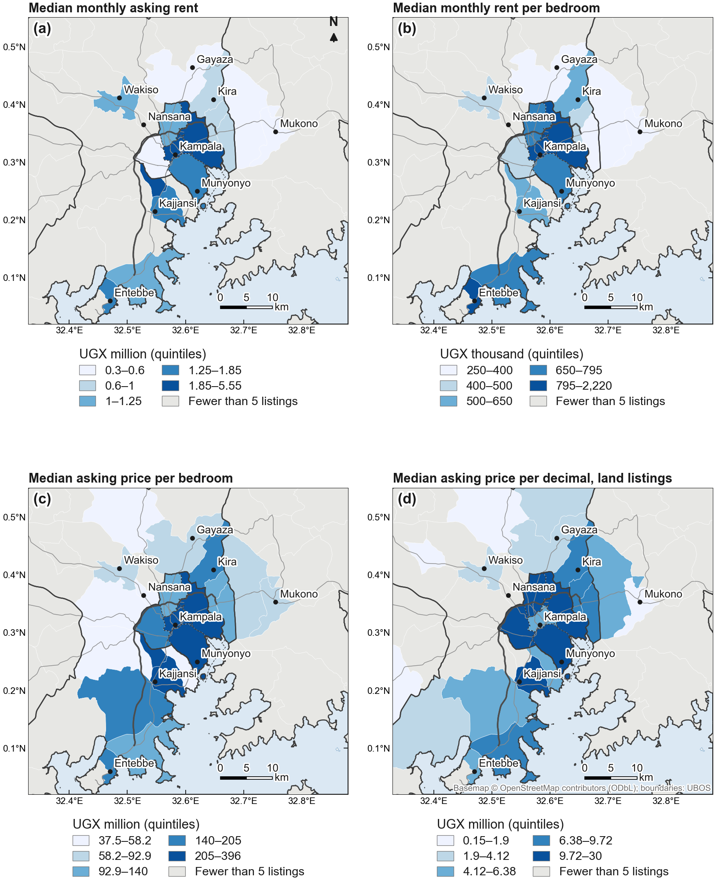

Local indicators identify where the clusters lie (Figures 6 and 7). High-value clusters of sale prices occupy Kampala's Central and Makindye divisions. High rents cluster along the Entebbe Road corridor—Ndejje and Bunamwaya divisions, Katabi Town Council and Entebbe's Division A—and in Makindye. Land prices per decimal form a broad high-value cluster covering four of Kampala's five divisions and the eastern and southern growth fronts of Wakiso (Kira, Namugongo, Kajjansi, Ndejje, Masajja) and Goma in Mukono. Low-value clusters appear on the north-western and northern fringes: Wakiso sub-county and town council for sale prices, and Gombe and Bombo for land.

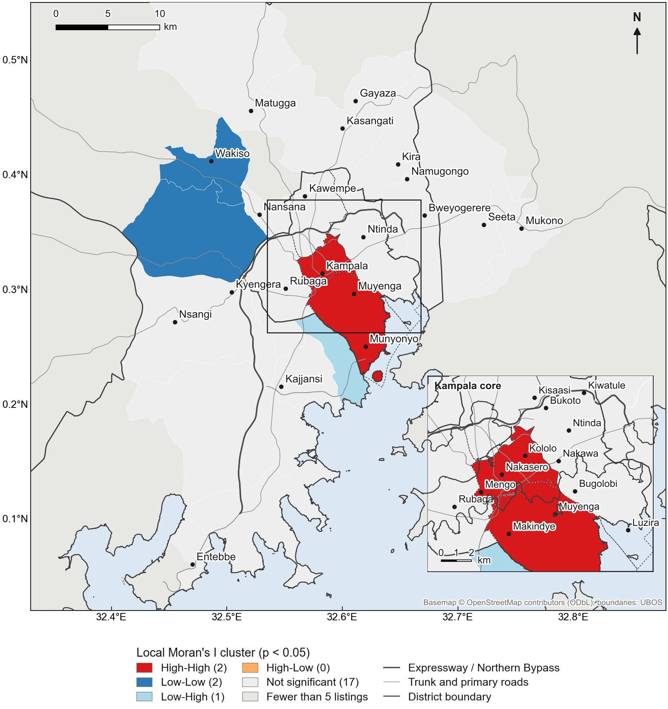

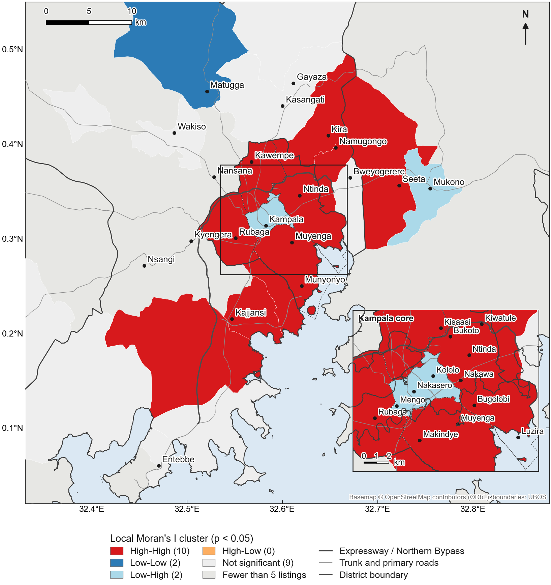

### 5.3. Drivers of prices and their spatial variation (RQ2; H2, H3)

Table 5 reports the hedonic models. Location and neighbourhood status carry large implicit prices, consistent with H2. For sale prices, a one-standard-deviation increase in the parish wealth index is associated with prices about 70% higher (coefficient 0.533, p < 0.001), holding structure, plot size and accessibility constant. Sale prices fall with distance from the Kampala–Entebbe Expressway (elasticity −0.22, p < 0.001), whereas distance to the Northern Bypass has no detectable effect. Plot size has an elasticity of 0.51, and storeyed houses are priced about 53% higher. For rents, distance to the central business district dominates the location effects (elasticity −0.40, p = 0.015); the wealth effect on rents is positive but not significant once distance is controlled. Rents rise with bedrooms at a decreasing rate—a second bedroom adds about 81% and a third about 65%—and furnished units command about 59% more. The negative coefficient on gated compounds in the rent model (−0.16) reflects their location rather than a discount for security: gated rental listings are a median 8.3 km from the CBD against 6.6 km for others, and are largely peripheral compound developments.

**Table 5. Hedonic models of log monthly rent and log sale price (selected coefficients).** Standard errors clustered by spatial unit; models also include property type, portal and listing-quarter fixed effects and the remaining accessibility and text-mined variables. *** p < 0.001, ** p < 0.01, * p < 0.05. ᵇ Both models include a squared bedrooms term (rent: −0.046***; sale: 0.001, n.s.).

| Variable | Rent: coef. (s.e.) | Sale: coef. (s.e.) |
|---|---|---|
| Parish wealth index (+1 s.d.) | 0.295 (0.344) | 0.533*** (0.146) |
| ln distance to CBD (km) | −0.396* (0.163) | −0.191 (0.127) |
| ln distance to Entebbe Expressway | −0.151 (0.134) | −0.221*** (0.065) |
| ln distance to Northern Bypass | 0.000 (0.071) | −0.022 (0.093) |
| ln distance to wetland | 0.003 (0.079) | −0.100 (0.087) |
| ln night-time radiance (500 m) | −0.094 (0.165) | 0.055 (0.146) |
| ln plot size (decimals) | — | 0.511*** (0.047) |
| Bedrooms (linear term)ᵇ | 0.733*** (0.063) | 0.057 (0.041) |
| Bathrooms | 0.119** (0.041) | 0.102*** (0.018) |
| Storeyed | 0.121* (0.049) | 0.424*** (0.053) |
| Furnished | 0.464*** (0.071) | 0.096 (0.086) |
| Gated compound | −0.162** (0.051) | 0.037 (0.058) |
| Self-contained | −0.022 (0.019) | 0.072* (0.033) |
| Title stated (ref.: not stated) | — | 0.120* (0.054) |
| Observations | 3,205 | 2,529 |
| Adjusted R² | 0.68 | 0.62 |
| Residual Moran's I | 0.19*** | 0.14*** |

The hedonic residuals remain spatially autocorrelated (Moran's I 0.19 for rents and 0.14 for sale prices, p = 0.001), which motivates the local models. MGWR on six core variables separates effects that vary across the city from those that are city-wide (Figure 8). For rents, the intercept, bedrooms, bathrooms and the two distance variables operate at local bandwidths of 272–335 nearest neighbours, while the effect of gating is global (bandwidth 2,810). For sale prices, the intercept (509) and the distance variables (386) vary locally, while bathrooms, self-containment and gating are close to global (2,032–2,352). The implicit price of location, in other words, is not one number but a surface.

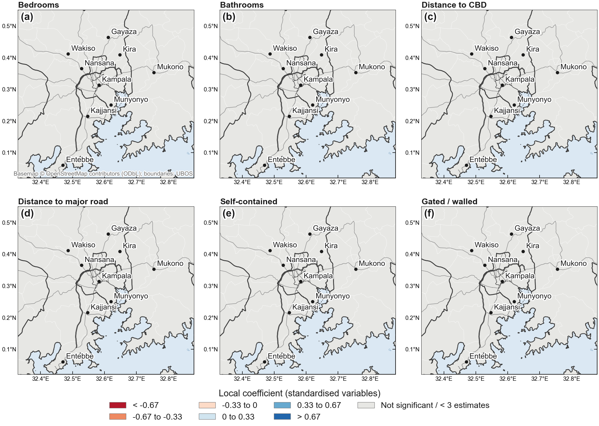

Tenure and title carry premia in the direction H3 predicts, although the online market offers little variation to identify them. Dwellings whose listing states a registered title are priced 12.8% higher than otherwise comparable listings that do not mention tenure (95% CI 1.4–25.5%, p = 0.027). Among land listings, freehold (+255%, n = 43) and leasehold (+409%, n = 26) plots are priced well above mailo, and kibanja plots—just above the 15-listing reporting threshold—about 60% below it (n = 15). The freehold and leasehold premia are large and imprecise, and probably reflect the selection of prime plots into these tenures as well as tenure itself; we treat them as indicative.

### 5.4. Machine learning, validation and interpretation (RQ3; H4)

Machine-learning models predict asking prices better than the hedonic model, but by less than random cross-validation suggests (Table 6), supporting H4. Under spatially blocked cross-validation on 3 km blocks, LightGBM reaches an out-of-sample R² of 0.63 for rents and 0.59 for sale prices, against 0.55 and 0.45 for the hedonic model. Random cross-validation overstates R² by 0.10–0.16 for every global model, because nearby listings—often at the same neighbourhood point—appear in both training and test folds.

**Table 6. Out-of-sample R² under random and spatially blocked five-fold cross-validation.** Mean (standard deviation) across folds. ᵃ Median across folds; GWR's spatially blocked fold values range from −38.6 to 0.14 (rent) and −1.38 to 0.47 (sale).

| Model | Rent: random CV | Rent: spatial CV | Sale: random CV | Sale: spatial CV |
|---|---|---|---|---|
| Hedonic OLS | 0.71 (0.04) | 0.55 (0.07) | 0.55 (0.03) | 0.45 (0.10) |
| GWR | 0.67 (0.05) | −0.35ᵃ | 0.45 (0.03) | 0.27ᵃ |
| Random forest | 0.77 (0.03) | 0.61 (0.04) | 0.68 (0.04) | 0.56 (0.07) |
| XGBoost | 0.77 (0.04) | 0.61 (0.04) | 0.69 (0.03) | 0.59 (0.04) |
| LightGBM | 0.77 (0.04) | 0.63 (0.04) | 0.69 (0.03) | 0.59 (0.04) |

GWR illustrates the gap most sharply. It predicts well within the areas on which it is calibrated (random cross-validation R² 0.67 for rents and 0.45 for sale prices), but it does not transfer to unseen areas: under spatial cross-validation its median fold R² is −0.35 for rents and 0.27 for sale prices, below the hedonic model in nine of ten folds, because local coefficients for a held-out block must be borrowed from neighbourhoods outside it.

SHAP values for the best models show which features drive predictions (Figures 9 and 10). For rents, the leading drivers are bedrooms, bathrooms, the listing portal, distance to the CBD and furnishing. For sale prices, they are bathrooms, plot size, property type, bedrooms and the parish share of households owning a computer—a component of the wealth index—followed by latitude and night-time radiance. That the portal ranks third for rents indicates that the portals serve different segments of the rental market, which the fixed effects in the hedonic models absorb.

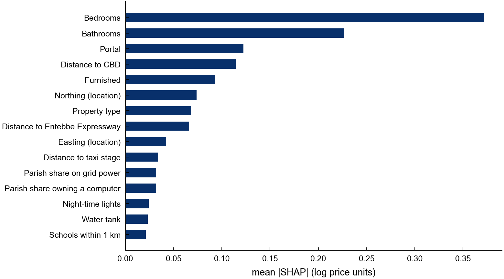

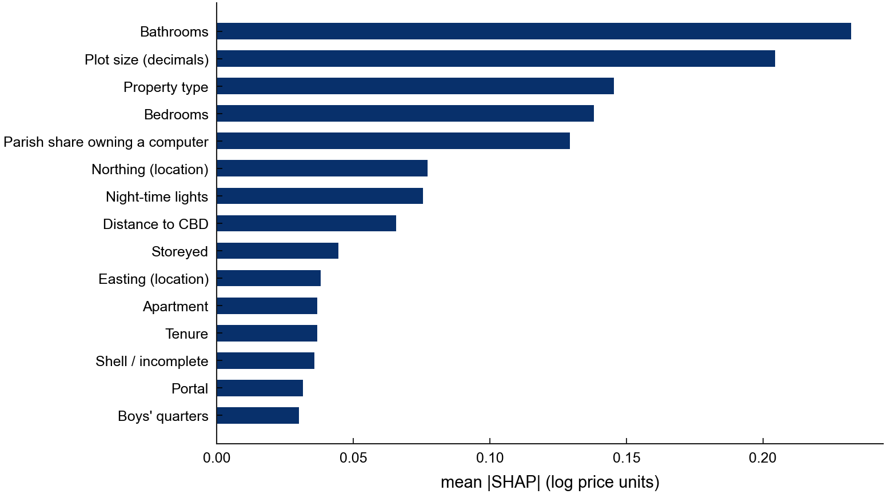

### 5.5. The GKMA Housing Affordability Index (RQ4; H5)

The typical listed home is far beyond the reach of the typical household in every district, for renting and still more for ownership, supporting H5 (Table 7; Figure 11). The median GKMA household, with a modelled income of UGX 547,000 a month, would need UGX 3.0 million to rent the median listed one- to two-bedroom home (UGX 900,000) within 30% of income: the Rental Affordability Index is 18.2 (95% CI 18.2–19.3), and 97.5% of households fall below the qualifying income. On the base mortgage terms, the median listed house or apartment (UGX 470 million) requires a monthly repayment of UGX 5.15 million and a qualifying income of UGX 14.7 million—about 27 times the median income. The Ownership Affordability Index is 3.7 (95% CI 3.5–3.9), and effectively all households are priced out.

**Table 7. The GKMA Housing Affordability Index, base case.** Incomes and rents in UGX per month (2026 prices); 95% bootstrap intervals from 1,000 resamples of listings. Buikwe, Luwero and Mpigi have fewer than 20 qualifying listings.

| Area | Households | Median income | Median rent (n) | RAI (95% CI) | AGI rent | Median price, UGX m (n) | Monthly repayment | OAI (95% CI) | AGI own |
|---|---|---|---|---|---|---|---|---|---|
| GKMA | 1,960,816 | 546,926 | 900,000 (2,086) | 18.2 (18.2–19.3) | 97.5% | 470 (3,896) | 5,151,869 | 3.7 (3.5–3.9) | 100.0% |
| Kampala | 479,515 | 870,719 | 1,200,000 (1,133) | 21.8 (21.8–24.9) | 98.9% | 956 (1,094) | 10,479,121 | 2.9 (2.7–3.1) | 100.0% |
| Wakiso | 891,803 | 586,520 | 710,000 (883) | 24.8 (23.5–25.1) | 94.1% | 420 (2,463) | 4,603,798 | 4.5 (4.2–4.7) | 100.0% |
| Mukono | 239,483 | 406,975 | 350,000 (70) | 34.9 (24.4–40.7) | 86.6% | 210 (317) | 2,301,899 | 6.2 (5.2–6.5) | 99.9% |

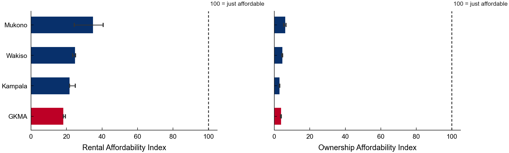

Among districts, Kampala is the least affordable for ownership (OAI 2.9), because its higher incomes are outweighed by house prices twice those of Wakiso; Mukono is the least unaffordable (RAI 34.9, OAI 6.2), though its rental index rests on only 70 listings and has a wide interval. Within districts, the index varies considerably (Figures 12–14): across the 12 sub-counties with enough rental listings the RAI ranges from 16 to 50, and across the 22 with enough sale listings the OAI ranges from 1.1 to 19.8. No sub-county reaches 100 on either index. At parish level (Supplementary Figures S1–S3), the RAI ranges from 5 in Naguru II to 89 in Kanyanya, but individual parish values rest on few neighbourhood points and wide intervals.

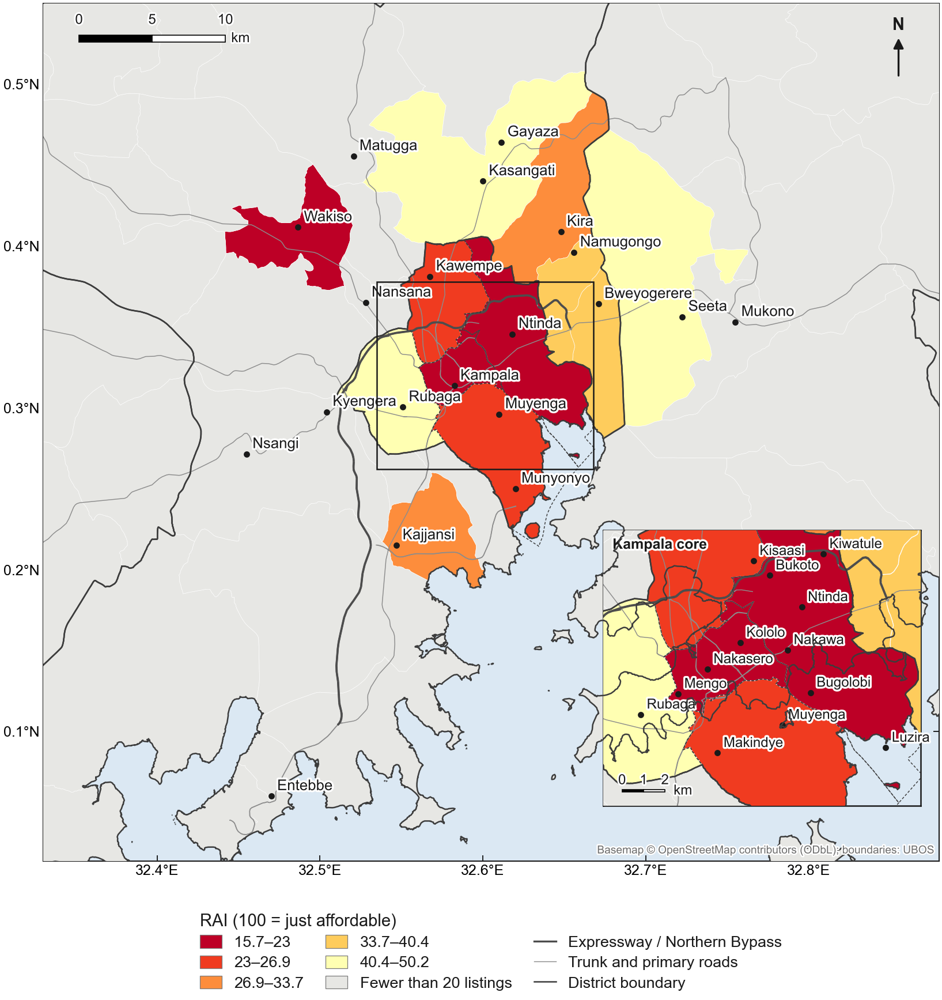

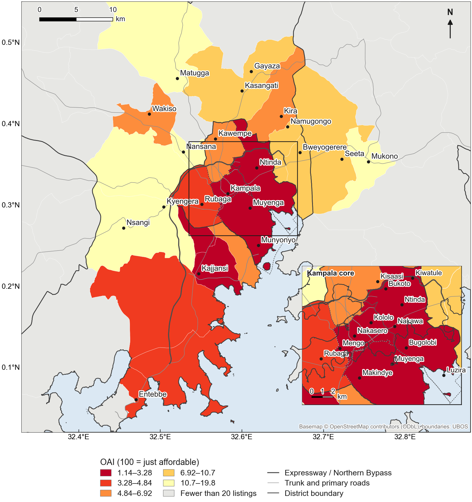

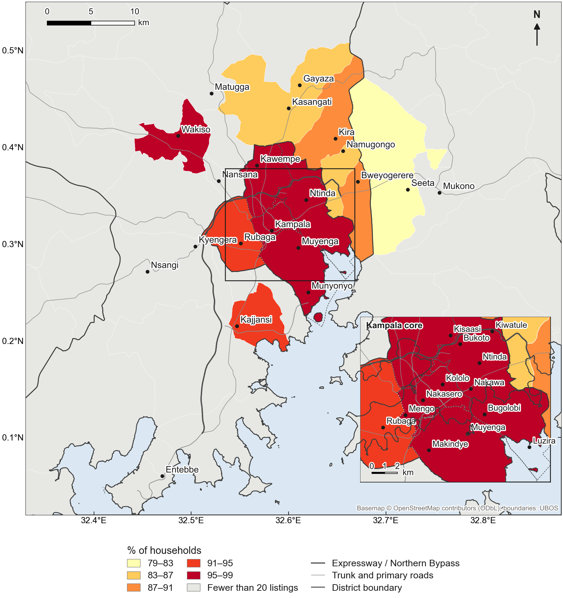

The conclusion does not depend on the 30% threshold (Figure 15). The median GKMA household would need 165% of its income to rent the median listed one- to two-bedroom home (Kampala 138%, Wakiso 121%, Mukono 86%) and 942% to service a mortgage on the median listed house. Raising the tolerable burden from 30% to the "severe" threshold of 50% lowers the share of GKMA households priced out of renting only from 97.5% to 91%; even at 80% of income, 78% remain priced out (Kampala 79%, Wakiso 68%, Mukono 53%). For ownership, more than 99% of households are priced out at every threshold between 10% and 80%.

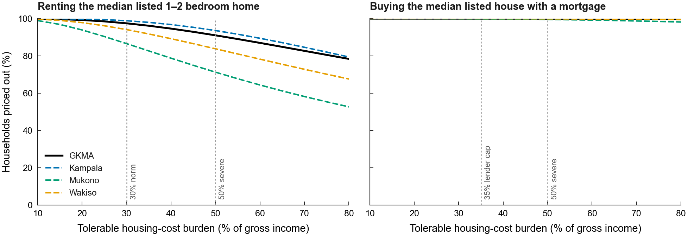

The residual-income test gives the same answer without a normative threshold (Figure 16). Of GKMA households, 78.5% could not rent the median listed one- to two-bedroom home and still meet their minimum non-housing needs: 19% are below that minimum before paying any rent, and a further 59% would be pushed below it by the rent. In Kampala, where few households are below the minimum before housing costs, 75% would be pushed into housing-induced poverty; in Wakiso 54% and in Mukono 35%. After paying the median rent, the median GKMA household would be UGX 589,000 a month short of the minimum. For mortgage-financed ownership, 99.6% of households fail the test, 80% of them because of the repayment. The residual-income measure is less severe than the 30% ratio because it allows better-off households to spend more than 30% of income on housing; its GKMA value corresponds to the ratio measure at a burden of about 80%.

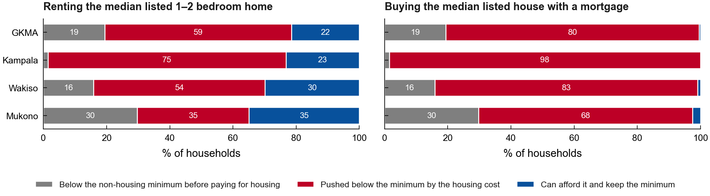

The ownership index is insensitive to plausible changes in mortgage terms (Supplementary Table S1). Across lending rates of 16–22%, deposits of 20–50%, terms of 15–25 years and repayment caps of 30–35%, the GKMA OAI ranges from 3.1 to 5.2, and district values from 2.5 to 8.7. The largest effect comes from the 50% deposit that Housing Finance Bank requires outside Kampala, but even this raises the index by less than half. Income dispersion matters for the gap index but not its conclusion: on the locally matched measure below, varying σ by ±20% moves the share of Kampala households unable to afford the median 1–2 bedroom rent between 95% and 99%.

Comparing rents with the incomes of the parishes where the rental listings are located, rather than of all parishes in the area, gives lower but still very high gaps: 97% in Kampala, 87% in Wakiso and 77% in Mukono, against 99%, 94% and 87% on the area-wide index. The difference measures how far formal rental supply concentrates in better-off neighbourhoods.

### 5.6. Land and structure

Land accounts for about half or more of house prices. Subtracting the depreciated replacement cost of the structure from asking prices gives a median land share of 46–66%, depending on the assumed floor area per bedroom (25–40 m²); 11–22% of houses have a negative implied land value under the same assumptions, indicating that the construction-cost benchmark overstates the cost of some listed houses (Figure 17). Implied land values per decimal rank sub-counties consistently with the asking prices of land-only listings (Spearman's ρ = 0.77–0.81) but are 1.8–2.4 times higher.

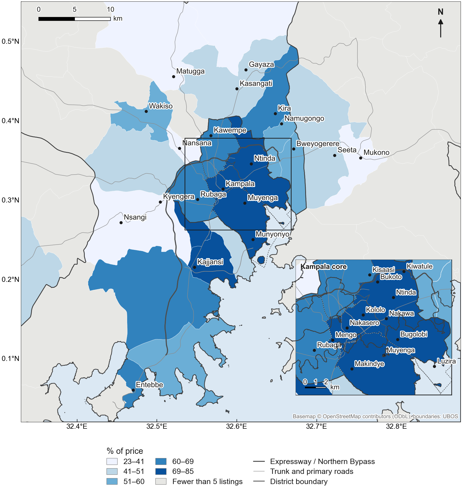

### 5.7. Validation, sample adequacy and robustness

A quarter-by-quarter comparison with the UBOS Residential Property Price Index was not feasible: dated listings cluster in 2025 Q3 and 2026 Q3, so only seven area-quarters could be compared, most resting on fewer than 20 listings. The comparison is reported in the Supplementary Materials but not interpreted.

The sample is adequate for the outputs reported (Section 4.3). The precision curve (Supplementary Figure S4) shows 95% intervals of about ±30% of the median rent at the 20-listing threshold and about ±19% at 50 listings; re-estimating the index on random subsamples of 50–90% of the listings (Supplementary Figure S5) changes the GKMA indices by less than 0.1 index points and district indices by less than 1.6 points.

The main results are robust to the sample (Supplementary Table S2). With neighbourhood-level locations only (9,381 listings), the GKMA RAI is 18.2 and the OAI 3.5, against 18.2 and 3.7 in the full sample; leaving out each portal in turn gives an RAI of 16.7–18.2 and an OAI of 3.5–3.9. The wealth effect on sale prices (0.44–0.60 log points per standard deviation) and the plot-size elasticity (0.47–0.51) are stable across all variants. Three effects depend on a single portal and are reported with that caveat: without RED listings, the title premium and the Expressway effect lose significance; without Jiji listings, the CBD gradient in rents largely disappears. The title premium keeps its size (0.10–0.12) in every variant that includes RED, but is only marginally significant (p ≈ 0.05–0.06) with neighbourhood-level locations only or without Uganda Property Centre.

## 6. Discussion

### 6.1. A titled, formal market

The most basic finding is about what online listings reveal. Kibanja and customary land, and untitled houses, are almost absent from the online market. This is itself evidence for the market visibility filter in the conceptual framework: online platforms capture the formal, registered and upper segment of the housing market, and leave out the informal rentals (*muzigo*) and kibanja holdings in which most Kampala households live. It is consistent with UNHS evidence that most Kampala renters occupy single rooms [@ubos2021unhs], with evidence that mailo tenure sustains a large informal rental sector [@birdvenables2020], and with international evidence that rental platforms under-represent lower-priced segments [@boeing2020]. The affordability index therefore measures the gap between the formal housing on offer and the incomes of the households who would need it. That is not the whole housing market, but it is the gap that matters for "affordable housing" policy aimed at formal supply, and for mortgage-led homeownership policy.

### 6.2. What drives prices, and where

Location and neighbourhood status carry more of the price than structure does, in line with bid-rent expectations [@alonso1964] but modified by transport corridors. Neighbourhood wealth raises sale prices by about 70% per standard deviation. The Entebbe Expressway is capitalised into house prices and the Entebbe Road corridor forms a high-rent cluster, whereas the Northern Bypass shows no effect. One possible explanation is that the Expressway provides a tolled, high-speed link to the airport and the lakeside suburbs, whereas the Bypass mainly carries through-traffic. Rents, by contrast, follow a classic distance gradient from the CBD. The MGWR bandwidths show that these location effects vary across the city while some structural effects do not: the premium for a bathroom or a gated compound is much the same everywhere, but the value of proximity is not. Because listings are located to neighbourhood points, these local effects describe neighbourhoods rather than streets.

The tenure results partly diverge from Irumba's analysis of 2011 transactions, which ranked leasehold above mailo and mailo above freehold for new houses [@irumba2015]; here freehold and leasehold land is priced well above mailo. Land rather than houses, asking rather than transaction prices, a fifteen-year gap, and the likely selection of prime plots into freehold and leasehold could each explain the difference. The premium for stating a title on a house can reflect the value of tenure security [@besley1995] or the seller's signal of a clean, marketable property; listings cannot separate the two.

### 6.3. Machine learning and spatial validation

Machine learning improves on the hedonic model, as Embaye et al. found for Ugandan survey rents [@embaye2021], but spatial validation shows that the gain is smaller than random cross-validation suggests [@roberts2017; @ploton2020]. The overstatement—0.10–0.16 in R²—comes from spatial leakage, and it is amplified by the clustering of listings at shared neighbourhood points. For any use that requires prediction in places without listings, such as valuing properties in unmapped neighbourhoods, spatially validated performance is the relevant benchmark. GWR makes the point most sharply: the local model that best describes price variation among sampled neighbourhoods is the worst at predicting prices in neighbourhoods it has not seen. Local models are tools for explanation, not for extrapolation.

### 6.4. Affordability, mortgages and land

The index is far below 100 in every district, for renting and for ownership. Ownership is an order of magnitude less affordable than renting. On the published terms of Uganda's largest mortgage lender—about 18% interest, a 30% deposit, 20 years and repayments of up to 35% of income—the qualifying income for the median listed house is about 27 times the median household income, and no plausible combination of mortgage terms changes this: even a 50% deposit leaves the GKMA OAI near 5. This helps explain why mortgage penetration in Uganda remains very low [@cahf2024], and it implies that mortgage-led homeownership policy cannot reach the median household without large reductions in prices or financing costs.

The conclusion does not rest on the 30% convention. Because the median listed rent exceeds the median household's entire income, no plausible burden threshold makes the typical listed home affordable to the typical household: the choice of norm changes the size of the unaffordable majority, not its existence. The residual-income test makes the same point without any threshold. For most GKMA households the question is not whether renting the typical listed home would take too large a share of income, but whether it would leave enough to live on. For about three in five households it would not: they are not poor before paying for housing, but would be after paying for it [@kutty2005]. The formal market is therefore effectively closed to the majority rather than merely expensive for it. The two approaches also differ where theory predicts they should [@stone2006]: the residual-income test is more lenient towards better-off households, which can spend more than 30% of income and still meet their basic needs, and stricter towards poorer ones, for whom even a small housing cost breaches the minimum.

The gap between the area-wide and the locally matched measures shows formal rental supply concentrating in better-off neighbourhoods—a spatial expression of the market visibility filter. The parish supplement shows the same pattern more sharply but less reliably: the parishes with enough listings to compute an index hold only 12% of GKMA households.

Land accounts for about half or more of house prices, so affordability is partly a land problem. Policies that lower construction costs alone cannot close a gap in which land is the larger component; land supply, serviced plots and tenure regularisation matter as much. That implied land values exceed the asking prices of land-only listings suggests either an asking-price premium on houses or construction costs above the CAHF benchmark for upper-market houses.

Because the index is built from open data and a reproducible pipeline, it can be updated regularly from new listings and published statistics. For the Ministry of Lands, Housing and Urban Development and the Kampala Capital City Authority, it offers a way to track affordability at district and sub-county level, to target affordable-housing interventions to the sub-counties where the gap is widest, and to test how far changes in prices, incomes or mortgage terms would move it.

### 6.5. Limitations

Several limitations qualify these results. First, the data are asking prices, not transaction prices, and represent the formal, titled, upper segment of the market; informal rentals and kibanja holdings are largely absent. Second, the sample is concentrated in time: collection stopped when the analysis sample exceeded 10,000 listings, so RED listings posted between about late September 2025 and late June 2026 were not collected, and dated listings cluster in 2025 Q3 (1,992) and 2026 Q3 (3,819). Convergence tests indicate that this does not affect the index, but it prevents a quarterly comparison with the UBOS price index, and the index describes 2025–2026 as a whole rather than a single date. RED posting dates are themselves estimated from listing codes, with an accuracy of about one month.

Third, parish incomes are modelled rather than observed: the model is calibrated on 15 sub-regions (R² = 0.65), uses an asset index as an income proxy, combines a 2019/20 survey with the 2024 census, assumes lognormal incomes and applies district or sub-region dispersion within parishes, which probably overstates within-parish inequality. The 2016 parish boundaries match Census 2024 parishes for 93% of households. The residual-income test adds assumptions about the poverty line, adult equivalents and the housing share of spending.

Fourth, spatial resolution is limited. The study was designed at parish level, but listings are located to 187 neighbourhood points and only 37 parishes have 20 or more qualifying listings. Headline results are therefore reported for sub-counties, districts and the GKMA; parish values appear only in the supplement. Aggregation to sub-counties trades local detail for precision and may mask contrasts between adjacent parishes; address-level geocoding or portal coordinates would allow a parish index. Coverage is thin outside Kampala and Wakiso: Buikwe, Luwero and Mpigi lack enough listings for index values, and the freehold and leasehold samples are small.

Fifth, the ownership index rests on working assumptions: the average commercial lending rate and the published terms of one lender stand in for a small market of about eight lenders whose products vary; many purchases are cash-financed or incremental rather than mortgage-financed; and the repayment cap applies to gross salaried income, which suits formally employed households better than those with informal incomes. Median incomes are combined with a consumption-based Gini coefficient. Finally, construction costs for storeyed and high-specification houses rest on stated assumptions; OpenStreetMap completeness varies and wetlands are a proxy rather than a modelled flood hazard; and data permissions for two portals were being finalised during the study.

### 6.6. Further research

Four extensions follow. Transaction data from the land registry or valuation rolls would allow asking prices to be calibrated against sale prices. Repeated collection would turn the index into a quarterly series that could be validated against the UBOS price index. Access to household survey microdata would allow a direct small-area income model in place of the asset-based approach used here. And because the pipeline depends only on public listings and published statistics, it can be extended to other Ugandan cities and to comparable metropolitan areas elsewhere in East Africa.

## 7. Conclusions

This study set out to measure how affordable the housing on offer in Greater Kampala is to the households who would need it, and where. From 10,643 deduplicated online listings, Census 2024 small-area indicators, household survey incomes and Bank of Uganda lending rates, it constructs a transparent, reproducible Housing Affordability Index for the GKMA, its districts and sub-counties.

Four conclusions follow. First, online listings describe an almost entirely titled, formal market concentrated in better-off neighbourhoods. Second, prices are strongly clustered, and location and neighbourhood status drive them more than structure; their effects vary across the city, and machine learning improves prediction by less than random validation suggests. Third, the typical listed home is far beyond the typical household: the median GKMA household earns 18% of the income needed to rent the median listed one- to two-bedroom home and 4% of the income needed to buy the median listed house with a mortgage. This holds under any burden threshold from 10% to 80% of income and under a residual-income test, by which about three in five households would be pushed into poverty by the typical listed rent. Fourth, land accounts for about half or more of house prices.

For policy, the results imply that affordable-housing and mortgage programmes aimed at the formal market will not reach the median household without substantial reductions in prices, land costs or financing costs, and that most households will continue to be housed outside the market that these listings describe. The index offers a way to monitor that gap, and to target interventions to the places where it is widest.

## Supplementary Materials

The following are available online: Figure S1: Listings located in each parish; Figure S2: Rental Affordability Index by parish; Figure S3: Ownership Affordability Index by parish; Figure S4: Precision of area medians by number of listings; Figure S5: Stability of the affordability index as the sample grows; Table S1: Ownership Affordability Index under alternative mortgage terms; Table S2: Robustness of key results to the sample; Table S3: Listing-based hedonic index and the UBOS Residential Property Price Index; Table S4: Affordability across burden thresholds of 10–80% of income; Table S5: Cleaning and geocoding log.

## Author Contributions

[TO COMPLETE, CRediT taxonomy: Conceptualization; Methodology; Software; Formal analysis; Data curation; Writing—original draft; Writing—review and editing; Visualization; Supervision.] All authors have read and agreed to the published version of the manuscript.

## Funding

[TO COMPLETE: This research received no external funding / funding details.]

## Institutional Review Board Statement

[TO COMPLETE: University of Johannesburg ethics clearance reference.] The study uses publicly accessible listings and published aggregate statistics; no personal data were retained (Section 4.4).

## Informed Consent Statement

Not applicable.

## Data Availability Statement

The code for the full pipeline and the derived, non-identifying data (area-level medians, index values and model outputs) will be made available in a public repository on publication. Raw listing texts are not redistributed, in keeping with the portals' terms. Census 2024, UNHS 2019/20 and Bank of Uganda data are publicly available from UBOS and the Ministry of Finance, Planning and Economic Development.

## Acknowledgments

[TO COMPLETE.]

## Conflicts of Interest

The authors declare no conflicts of interest.
