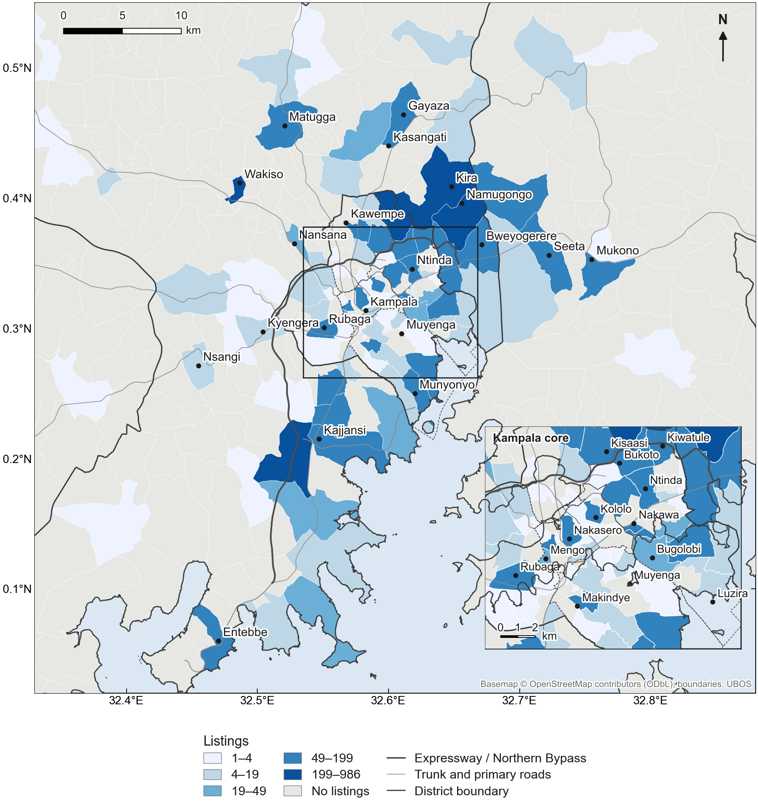
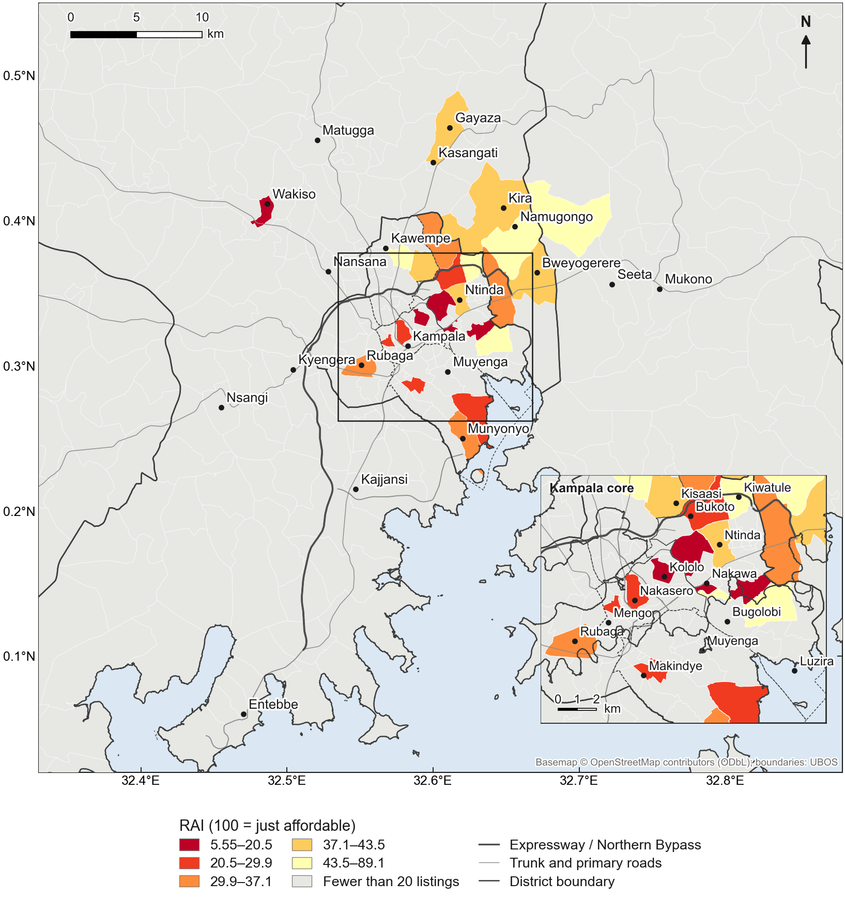
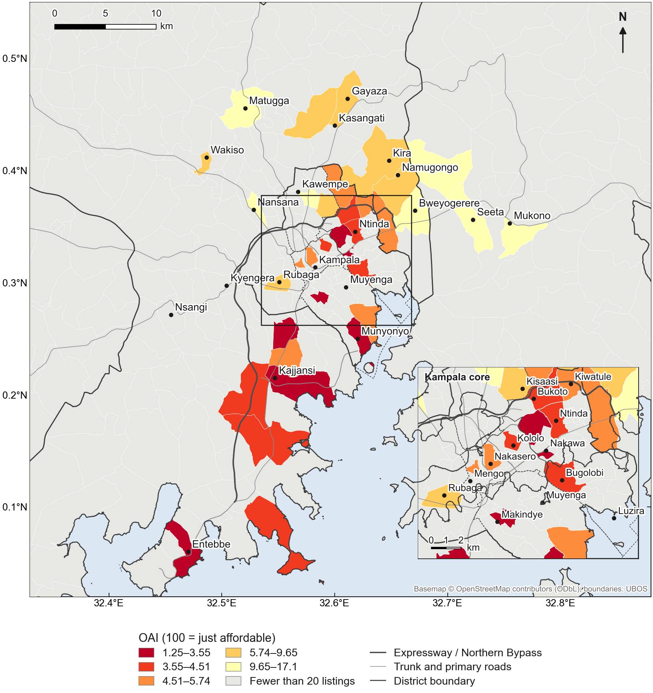
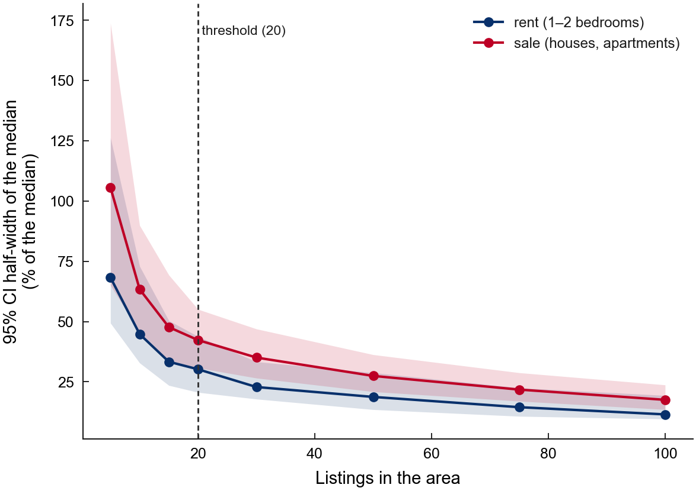
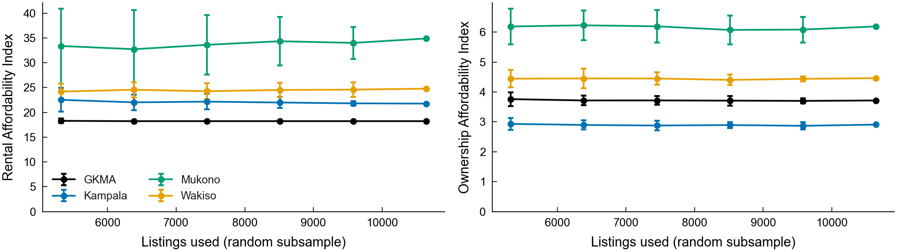

# Supplementary Materials

*Priced out of the formal market: A housing affordability index and spatial machine-learning analysis for Greater Kampala, Uganda*

**Table S1. Ownership Affordability Index under alternative mortgage terms.** Base: BoU 12-month mean lending rate (18.3%), 30% deposit, 20 years, 35% repayment cap; each column changes one term.

| Area | Base | Rate 16% | Rate 22% | Deposit 20% | Deposit 50% | 15 years | 25 years | Cap 30% |
|---|---|---|---|---|---|---|---|---|
| GKMA | 3.7 | 4.2 | 3.1 | 3.3 | 5.2 | 3.6 | 3.8 | 3.2 |
| Kampala | 2.9 | 3.3 | 2.5 | 2.5 | 4.1 | 2.8 | 3.0 | 2.5 |
| Wakiso | 4.5 | 5.0 | 3.8 | 3.9 | 6.2 | 4.3 | 4.5 | 3.8 |
| Mukono | 6.2 | 7.0 | 5.2 | 5.4 | 8.7 | 5.9 | 6.3 | 5.3 |

**Table S2. Robustness of key results to the sample.** Hedonic coefficients; * p < 0.05.

| Sample | Listings | GKMA RAI | GKMA OAI | Wealth (sale) | ln plot size (sale) | Title stated (sale) | ln dist. Expressway (sale) | ln dist. CBD (rent) |
|---|---|---|---|---|---|---|---|---|
| Full sample | 10,643 | 18.2 | 3.7 | 0.533* | 0.511* | 0.120* | -0.221* | -0.396* |
| Neighbourhood-level locations only | 9,381 | 18.2 | 3.5 | 0.435* | 0.514* | 0.108 | -0.162* | -0.652* |
| Without Jiji | 6,907 | 18.2 | 3.5 | 0.441* | 0.468* | 0.122* | -0.210* | -0.162 |
| Without RED | 4,614 | 16.7 | 3.7 | 0.604* | — | 0.058 | 0.024 | -0.403* |
| Without Uganda Property Centre | 9,765 | 18.2 | 3.9 | 0.508* | 0.512* | 0.104* | -0.185* | -0.661* |

**Table S3. Listing-based hedonic index and the UBOS Residential Property Price Index.** Reported for completeness; most quarters rest on fewer than 20 listings and are not interpreted.

| Area | Quarter start | Listings | Listing index | UBOS RPPI (rebased) |
|---|---|---|---|---|
| Wakiso | 2022-10-01 | 8 | 100.0 | 100.0 |
| Wakiso | 2025-01-01 | 3 | — | 105.9 |
| Wakiso | 2025-04-01 | 6 | — | 113.2 |
| Wakiso | 2025-07-01 | 523 | — | 121.4 |
| Wakiso | 2025-10-01 | 6 | — | 121.6 |
| Wakiso | 2026-01-01 | 17 | — | 119.5 |
| Wakiso | 2026-04-01 | 87 | — | 117.1 |
| Wakiso | 2026-07-01 | 964 | — | — |

**Table S4. Share of households priced out (%) across burden thresholds of 10–80% of income.**

| Burden threshold | GKMA: rent | Kampala: rent | Wakiso: rent | Mukono: rent | GKMA: own | Kampala: own | Wakiso: own | Mukono: own |
|---|---|---|---|---|---|---|---|---|
| 10% | 99.9 | 100.0 | 99.8 | 99.0 | 100.0 | 100.0 | 100.0 | 100.0 |
| 20% | 99.3 | 99.8 | 97.9 | 93.9 | 100.0 | 100.0 | 100.0 | 100.0 |
| 30% | 97.5 | 98.9 | 94.1 | 86.6 | 100.0 | 100.0 | 100.0 | 99.9 |
| 35% | 96.2 | 98.0 | 91.8 | 82.7 | 100.0 | 100.0 | 100.0 | 99.9 |
| 40% | 94.6 | 96.8 | 89.2 | 78.8 | 100.0 | 100.0 | 100.0 | 99.8 |
| 50% | 91.0 | 93.6 | 83.8 | 71.3 | 100.0 | 100.0 | 99.9 | 99.6 |
| 60% | 87.0 | 89.5 | 78.3 | 64.4 | 99.9 | 100.0 | 99.8 | 99.2 |
| 70% | 82.7 | 84.6 | 72.8 | 58.2 | 99.9 | 100.0 | 99.7 | 98.8 |
| 80% | 78.4 | 79.4 | 67.6 | 52.7 | 99.8 | 100.0 | 99.5 | 98.2 |

**Table S5. Cleaning log.** Location methods among resolved records: gazetteer exact 8,393; gazetteer contained name 2,568; district-level label 467; OpenStreetMap 342; sub-county 264; fuzzy 219; UBOS parish name 58.

| Step | Records |
|---|---|
| raw records (all snapshots) | 13424 |
| parsed | 13424 |
| drop short-stay / nightly | 13424 |
| drop missing price | 13418 |
| drop listing_type unknown | 13418 |
| location resolved | 12311 |
| after de-duplication | 10823 |
| inside GKMA study area | 10823 |
| drop price outliers (flagged) | 10749 |
| drop commercial | 10643 |
